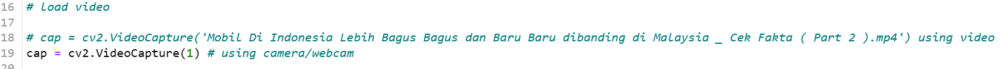
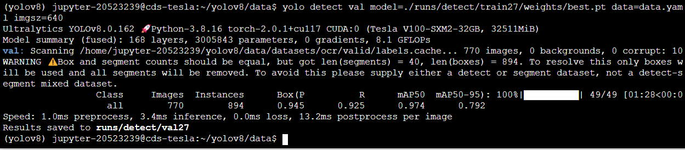
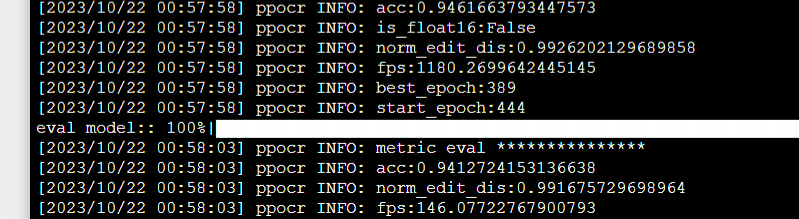

# ALPR Using YOLOv8 and PP-OCRv3
[](https://www.python.org/downloads/release/python-380/)


## Installation

This program was running on AMD Ryzen 5 CPU, for faster inferene you can use GPU

Create new anaconda env
```
conda create -n ocr python=3.8
```


Clone the repository first and install all the requirements. All the requirements are [here](./requirements.txt)
```
pip install -r requirements.txt
```

Download the model and custom_dict.txt then change the model directory in [here](./main.py) . It will download the angle classifier model and detection model aswell but I will not use the detection and angle classifier model since we already have detection model

```
reader = PaddleOCR(rec_model_dir='{model_dir}', rec_char_dict_path='{custom_dict_dir}')
np_model = YOLO('license_plate_detector.pt')

```

Run the main.py

```
python main.py
```

This program will open a opencv GUI and display frame, also save the detection results in csv, save image detection crops. To change from camera detection to load video change this code in main.py . To exit the program, you can just press q . It will write the detections into csv file.



## Dataset

- License Plate Detection [Here](https://universe.roboflow.com/yusuf-dimas-q1gol/kumpulan-plat).
- License Plate Recognition [Here](https://data.mendeley.com/datasets/j3256db3fz/1)

## Model Used

- YOLOv8n COCO [repo](https://github.com/ultralytics/ultralytics)
- YOLOv8n for LP Detection [repo](https://github.com/ultralytics/ultralytics)
- PP-OCRv3 for LP Recognition [repo](https://github.com/PaddlePaddle/PaddleOCR/blob/release/2.7/README_en.md)


## Pipeline Model

A Yolov8 COCO Model was first inferenced to get vehicle bounding box, then after we get the bounding box, we inference it with the License Plate Detection Model. After we got the LP Bounding Box, we Inference it using the LP Recognition Model. Vehicle that inferenced are car,bus,truck,motorcycle


## Training & Evaluation Result

A Yolov8 COCO Model was first inferenced to get vehicle bounding box, then after we get the bounding box, we inference it with the License Plate Detection Model. After we got the LP Bounding Box, we Inference it using the LP Recognition Model


- ### License Plate Detection Model

    Model was trained using 300 epoch and 16 batch . To train the model,
    
    ```
    yolo detect train model=yolov8.pt epoch=300 batch=16 data=data.yaml imgsz=640
    ```
    
    Evaluate model
    
    ```
    yolo detect val model={model_dir} data=data.yaml imgsz=640
    ```
    
    Results
    

- ### OCR Model 
    
    For training and dataset setup can be found [here](https://github.com/PaddlePaddle/PaddleOCR/blob/release/2.7/doc/doc_en/recognition_en.md)
    
    Training Config can be found here
    
    Model training ,
    
    ```
    python tools/train.py -c {config_file_path} -o Global.pretrained_model={path/to/weights}/best_accuracy

    ```

    Evaluate Model,
    
    ```
    python tools/eval.py -c {config_file_path} -o Global.checkpoints={path/to/weights}/best_accuracy
    ```
    
    Results
    

## Conclusion

After we run the model, a GUI Frame will popup and show camera source, you can change the camera source to another camera device by chanign the cv2.VideoCapture and set another number. Based on the evaluation result we can see that the LP Detection model was pretty good but the OCR Model still need more improvement ex: Adding More Dataset, Change Model Architecture, Skew and Tilt Correction